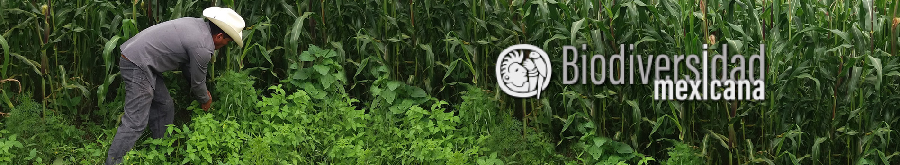

```{r setup, include=FALSE}
knitr::opts_chunk$set(echo = TRUE)
```
## Uricho

La Comisión Nacional para el Conocimiento y Uso de la Diversidad ( [Conabio](https://www.gob.mx/conabio)), a través del proyecto [Agrobiodiversidad mexicana](https://www.biodiversidad.gob.mx/biodiversidad/agrobiodiversidad_pgef.html), esta cuantificando y valorando la gran diversidad agrícola del país. Una de las herramientas son los **Grupos de Enfoque** enfocados en la producción presente en comunidades.  
*¿ Que es un grupo de Enfoque?*
Los grupos de enfoque son intercambios de conocimiento sobre los agrícultores, hombres y mujeres, nos comparten sus conocimientos. Una de las comunidades es `Uricho`.  
El taller se llevó acabo en `junio de 2019` con la participación de: *X hombres* y *X mujeres*. La actividad se dividió en cuatro partes:  

<div class="alert alert-info">
  <ol>
  <li> ¿Que es lo que producen? </li>
  <li> ¿Que es lo que consumen? </li>
  <li> ¿Que es lo que compran? </li>
  <li> ¿Que es lo que venden?   </li>
  </ol>
</div>

Los resultados son los siguientes:  

## Hoja 2  
```{r, out.width="450px", echo= FALSE}
dress <- c("pictures/")
estado <- c("michoacan/")
comunidad <- c("uricho/")
foto <- c("foto1")
tipo <- c(".jpg")

TT <- paste(dress, estado, comunidad, foto, tipo, sep = "")
knitr::include_graphics(TT)
```


